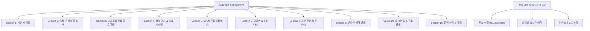

# 해아림한의원 안양점 웹사이트 제작 계획서 (plan.md)

## 1. 프로젝트 개요 (Project Overview)
- **프로젝트명:** 해아림한의원 안양점 공식 웹사이트 구축
- **목적:** 
  - 한방내과 전문의이자 상담심리학 박사의 전문성과 1:1 다각적 통합 치유 시스템(체질 한약 + 심리상담 + 뇌기능 훈련)을 전달하여 신뢰도 극대화
  - 직관적인 정보 탐색(특화 클리닉 5대 영역, 정밀 검사 4단계, 내원 6단계 프로세스 등)과 간편한 예약(네이버/카카오/유선전화) 전환 유도
- **타겟 사용자:** 
  - 자율신경실조증, 공황·불안·우울, 불면/스트레스, 소아청소년 틱·ADHD, 강박 및 신경계 질환으로 고통받는 환자 및 보호자
- **디자인 톤앤매너:** 
  - **신뢰감 & 심신 안정:** 따뜻하고 안정적인 뉴트럴 톤(Warm Sand/Ivory, Calming Sage Green, Deep Trust Navy)
  - **현대적 감각:** 글래스모피즘(Glassmorphism), 부드러운 카드 UI, 직관적인 마이크로 인터랙션, 모바일 퍼스트 반응형 레이아웃

---

## 2. 기본 정보 & 메타데이터 (Metadata)
| 항목 | 내용 |
| :--- | :--- |
| **상호명** | 해아림한의원 안양점 |
| **대표 슬로건** | 자율신경 조절과 뇌신경·심리 치유의 통합 솔루션 |
| **서브 슬로건** | 과민해진 신경계를 안정시키고, 몸과 마음의 균형과 일상을 회복합니다. |
| **핵심 차별점** | 한방내과 전문의이자 상담심리학 박사의 체질 한약 치료 + 심리상담 + 뇌기능 훈련 결합 1:1 다각적 통합 치유 시스템 |
| **대표 전화** | `031-382-8885` |
| **위치** | 경기도 안양시 동안구 동안로 120, 올림픽스포츠센터 309호 (범계역 3번 출구 도보 1분) |
| **진료 시간** | • **월·목 (야간진료):** 09:00 ~ 19:00 • **화·수·금:** 09:00 ~ 18:00 • **토요일:** 09:00 ~ 15:00 • **공휴일:** 09:00 ~ 14:00 • **점심시간:** 점심시간 없이 연속 진료 • **휴진:** 매주 일요일 |
| **예약 정책** | 정밀 검사 및 심층 상담을 위한 **100% 사전 예약제** |
| **주차 안내** | 올림픽스포츠센터 건물 내 지하 주차장 이용 가능 (진료 시 무료 주차 지원) |
| **온라인 채널** | • [네이버 실시간 예약](https://m.place.naver.com/hospital/1758514142/booking) • [카카오톡 채널 상담](https://pf.kakao.com/_FspIX/friend) • 네이버 블로그 RSS: `https://rss.blog.naver.com/hear-im.xml` • 유튜브 채널 RSS: `https://www.youtube.com/feeds/videos.xml?channel_id=UCAW0RqLUlt7OUr6p1FLfDvg` |

---

## 3. 사이트 구조 (Sitemap & Information Architecture)

웹사이트는 사용자의 스크롤 편의성과 정보 집중도를 높이기 위해 **모던 반응형 싱글페이지(섹션 앵커 네비게이션) + 상세 모달/탭 인터랙션** 구조로 구성합니다.

---

## 4. 페이지/섹션별 상세 기획 및 콘텐츠 명세

### [PAGE 1. 🏠 홈 (메인 히어로)]
- **헤드라인:** 자율신경 조절과 뇌신경·심리 치유의 통합 솔루션
- **서브라인:** 과민해진 신경계를 안정시키고, 몸과 마음의 균형과 일상을 회복합니다.
- **3중 신뢰 배지 (Trust Badges):**
  1. 🩺 **한방내과 전문의 & 상담심리학 박사** 직접 진료
  2. 🧠 **통증 없는 비침습적 정밀 뇌기능·자율신경 검사** (QEEG / HRV)
  3. ⏱️ **범계역 3번 출구 도보 1분** / **점심시간 없는 연속 진료**
- **주요 CTA 버튼:** `[네이버 실시간 예약]`, `[카카오톡 상담]`, `[5대 특화 클리닉 둘러보기]`
- **5대 특화 클리닉 퀵 배너 & 카드:** 클릭 시 해당 섹션/탭으로 부드럽게 스크롤 이동

---

### [PAGE 2. 🏢 원장 및 한의원 소개]
- **진료 철학:** *"증상 뒤에 가려진 몸과 마음, 뇌신경의 신호에 귀 기울입니다."*
  - 1:1 심층 진맥을 통한 개인별 맞춤 진료
  - 뇌파·자율신경 검사 등을 활용한 객관적 상태 평가와 맞춤 치료
  - 심리검사 및 상담을 통한 심신(心身) 상태의 종합적 평가
  - 감각통합 및 두뇌훈련 프로그램과 연계한 맞춤 케어
- **대표 원장 주요 프로필 및 전문 자격:**
  - 🎓 한방내과 전문의
  - 🎓 상담심리학 박사 (Ph.D.)
  - 📜 보건복지부 공인 임상심리사 1급
  - 📜 여성가족부 공인 청소년상담사
  - 📜 식품의약품안전처장 인증 사회재활상담사

---

### [PAGE 3. 📦 5대 특화 진료 프로그램 (카테고리 탭 UI)]
사용자가 직관적으로 증상과 치료 솔루션을 확인할 수 있는 탭형 컴포넌트:

1. **Tab 1. 자율신경·신체화 클리닉**
   - **대상 증상:** 자율신경실조증, 원인 모를 어지럼증·두통, 만성 피로, 가슴 두근거림, 과호흡
   - **맞춤 솔루션:** 교감·부교감신경 불균형 조절 한약, 뇌 혈류 순환 침구 치료, 자율신경 이완 훈련
2. **Tab 2. 공황·불안·우울 클리닉**
   - **대상 증상:** 공황장애, 범불안장애, 우울증, 화병, 외상 후 스트레스(PTSD)
   - **맞춤 솔루션:** 편도체 안정 한약 처방, 인지행동 심리상담, 급성 불안 대처 호흡 훈련
3. **Tab 3. 수면·스트레스 클리닉**
   - **대상 증상:** 불면증, 입면장애, 조기각성, 수면유지장애, 만성 스트레스 증후군
   - **맞춤 솔루션:** 멜라토닌 분비 촉진 한약, 뇌파 유도 훈련, 수면 위생 프로토콜
4. **Tab 4. 소아청소년 두뇌·정신건강 클리닉**
   - **대상 증상:** 틱장애, 뚜렛증후군, ADHD, 소아불안, 야경증, 학습장애
   - **맞춤 솔루션:** 소아 체질 맞춤 뇌안정 한약, 감각통합 훈련, 뉴로피드백, 학부모 양육 코칭
5. **Tab 5. 강박·뇌신경 질환 클리닉**
   - **대상 증상:** 강박증, 수전증·두전증(체질성 떨림), 뇌신경 마비 후유증
   - **맞춤 솔루션:** 신경계 흥분성 억제 한약, 두뇌 타이밍 훈련, 신경 안정 약침

---

### [PAGE 4. 🔬 정밀 검사 & 통합 치료 시스템]
- **안심 가이드 문구:** *"해아림의 모든 검사는 통증이나 부담이 없는 비침습적(Non-invasive) 정밀 검사로 진행됩니다."*
- **4대 정밀 검사 시스템:**
  1. **QEEG 뇌파 및 뇌기능 검사:** 뇌파 활성도 및 뇌신경 전달 리듬 정밀 분석
  2. **HRV 자율신경계 균형 검사:** 교감·부교감신경 활성도 및 스트레스 저항도 평가
  3. **종합 심리·정서 평가 척도:** 우울·불안·스트레스 및 기저 심리 상태 객관적 측정
  4. **한의학적 체질 진맥 & 설진·복진:** 오장육부 허실과 기혈 순환 불균형 감별
- **4대 통합 치료 시스템:**
  1. **1:1 맞춤 체질 한약 & 침구 치료:** 과민해진 신경계 안정 및 기혈 순환 촉진
  2. **뉴로피드백 & 바이오피드백 훈련:** 스스로 뇌파와 자율신경을 조절하는 두뇌 훈련
  3. **감각통합 및 인터랙티브 메트로놈(IM) 훈련:** 신경망 동기화 및 억제 조절력 향상
  4. **1:1 심리상담 & 인지행동치료:** 심리적 기저 원인 해소 및 인지 왜곡 교정

---

### [PAGE 5. 📋 내원에서 검사·진단까지 6단계 프로세스]
타임라인/스텝 카드로 시각화하여 초진 환자의 심리적 안정감 제공:
- **STEP 01. 사전 예약 및 접수** (대기 최소화를 위한 100% 사전 예약제 운영)
- **STEP 02. 사전 심리·정서 척도 설문 작성** (현재 증상 및 스트레스 지수 자가 체크)
- **STEP 03. 통증 없는 비침습적 정밀 검사** (뇌파 QEEG, 자율신경 HRV 객관적 측정)
- **STEP 04. 원장 1:1 심층 진맥 및 종합 상담** (전문의 & 심리학 박사의 다각적 데이터 분석)
- **STEP 05. 맞춤 통합 치료 & 두뇌 훈련 시행** (맞춤 한약, 침구, 뉴로피드백, 감각통합)
- **STEP 06. 치료 경과 재평가 & 일상 관리 지도** (주기적 호전도 평가 및 수면·생활습관 코칭)
- 💡 *초진 소요 시간 안내: 약 1시간 ~ 1시간 30분*

---

### [PAGE 6. 🎥 해아림 미디어 & 칼럼]
- **RSS 연동 구성:**
  - 네이버 블로그: `https://rss.blog.naver.com/hear-im.xml`
  - 유튜브 채널: `https://www.youtube.com/feeds/videos.xml?channel_id=UCAW0RqLUlt7OUr6p1FLfDvg`
- **카테고리 필터 탭:** `[#전체]`, `[#자율신경]`, `[#공황·불안]`, `[#소아틱·ADHD]`, `[#수면]`
- **콘텐츠 카드 UI:** 썸네일, 타이틀, 요약, 출처 태그(블로그/유튜브), 발행일 표시

---

### [PAGE 7. ❓ 자주 묻는 질문 (FAQ 아코디언)]
1. **Q. 양약(신경안정제, 수면제, 항우울제 등)을 복용 중인데 한방 치료 병행이 가능한가요?**
   - **A.** 네, 병행 가능합니다. 복용 중인 양약을 임의로 중단하는 것은 권장하지 않으며, 한약과 신경계 안정 치료를 병행하여 신체 자생력과 조절력이 회복됨에 따라 기존 처방 의료진과 상의하여 점진적으로 감량해 나가는 것을 목표로 합니다.
2. **Q. 치료 기간은 보통 얼마나 걸리나요?**
   - **A.** 증상의 유병 기간과 과민도, 체질에 따라 차이가 있습니다. 일반적으로 초기 1~3개월은 급성 증상 안정, 이후 3~6개월은 자율 조절력 강화와 재발 방지를 목표로 치료 및 훈련을 진행합니다.
3. **Q. 소아 틱장애나 ADHD는 뇌기능 훈련과 한약으로 개선될 수 있나요?**
   - **A.** 틱장애와 ADHD는 아이의 의지 부족이 아닌 두뇌 신경계의 불균형과 조절력 미성숙에서 기인합니다. 맞춤 한약으로 뇌 신경계를 안정시키고 뉴로피드백 및 감각통합 훈련을 통해 뇌신경망 조절력을 높여 개선합니다.
4. **Q. 뇌파나 자율신경 검사 시 통증이나 부작용이 있나요?**
   - **A.** 해아림의 모든 검사는 통증이나 신체 자극이 없는 비침습적(Non-invasive) 정밀 검사이므로 어린이부터 노약자까지 안심하고 검사받으실 수 있습니다.
5. **Q. 초진 시 진료 시간은 얼마나 소요되며 예약이 필수인가요?**
   - **A.** 설문, 정밀 검사, 1:1 심층 맥진 및 종합 상담까지 약 1시간~1시간 30분이 소요됩니다. 깊이 있는 진료를 위해 100% 사전 예약제로 운영됩니다.

---

### [PAGE 8. 📅 온라인 예약 & 이용 수칙]
- **실시간 예약 링크 연동:**
  - `[네이버 간편 예약 (바로가기)]` (https://m.place.naver.com/hospital/1758514142/booking)
  - `[카카오톡 1:1 상담 (바로가기)]` (https://pf.kakao.com/_FspIX/friend)
- **예약 수칙 박스:**
  - 100% 사전 예약제 운영 안내
  - 당일 긴급 예약은 유선 전화(`031-382-8885`) 권장
  - 예약 변경/취소 시 최소 1일 전 연락 권장

---

### [PAGE 9. 📍 오시는 길 & 진료시간 안내]
- **위치:** 경기도 안양시 동안구 동안로 120, 올림픽스포츠센터 309호 (4호선 범계역 3번 출구 도보 1분)
- **교통편:** 지하철 4호선 범계역 3번 출구 직진
- **주차:** 올림픽스포츠센터 지하 주차장 완비 (무료 주차 지원)
- **진료 시간표 (테이블 & 강조 배지):**
  - **월·목 (야간진료):** 09:00 ~ 19:00
  - **화·수·금:** 09:00 ~ 18:00
  - **토요일:** 09:00 ~ 15:00
  - **공휴일:** 09:00 ~ 14:00
  - **점심시간:** **점심시간 없이 연속 진료**
  - **휴진:** 매주 일요일
- **네이버 지도 연동 / 길찾기 버튼 제공**

---

### [PAGE 10. ✉️ 간편 상담 & 푸터 (Footer)]
- **빠른 문의 3대 옵션:**
  1. `[📞 031-382-8885 전화 연결]`
  2. `[💬 카카오톡 채널 1:1 비밀상담]`
  3. `[🟢 네이버 플레이스 바로가기]`
- **푸터 구성:** 상호, 대표자, 사업자등록번호, 주소, 전화번호, 개인정보처리방침, 저작권 표기

---

## 5. UI/UX 디자인 시스템 가이드

### 컬러 팔레트 (Color Palette)
- **Primary:** `#1E3A5F` (신뢰를 주는 딥 네이비 - Deep Navy)
- **Secondary:** `#3D7B70` (안정과 치유를 상징하는 힐링 세이지 그린 - Sage Green)
- **Accent:** `#E08B58` (따뜻한 포인트 오렌지 테라코타 - Warm Terracotta)
- **Background Light:** `#F8FAF9` (부드러운 아이보리 톤 화이트)
- **Surface / Card:** `#FFFFFF` (입체감 있는 카드 섀도우)
- **Text Main:** `#1F2937` / **Text Muted:** `#6B7280`

### 타이포그래피 (Typography)
- 기본 폰트: `Pretendard`, `-apple-system`, `BlinkMacSystemFont`, `sans-serif`
- 가독성과 신뢰성을 고려한 폰트 스케일 및 줄간격(Line-height: 1.6~1.8) 적용

### 인터랙션 & 컴포넌트
- **Sticky CTA Bar (하단/사이드 고정):** 모바일 및 데스크톱에서 예약/전화/카카오톡 상시 노출
- **반응형 탭 (Tab UI):** 5대 특화 클리닉 즉시 전환
- **아코디언 (Accordion UI):** FAQ 펼치기/접기 애니메이션
- **부드러운 스크롤 (Smooth Scroll):** 상단 메뉴 클릭 시 각 섹션으로 부드러운 이동

---

## 6. 개발 및 실행 로드맵 (Milestones)

1. **Step 1: 기본 셋업 & 디자인 시스템 정의**
   - HTML5 시맨틱 구조 (`index.html`)
   - 현대적인 CSS 토큰, 변수 및 레이아웃 스타일 (`style.css` 또는 `css/`)
2. **Step 2: 10개 핵심 섹션 마크업 및 콘텐츠 배치**
   - 홈(히어로), 원장소개, 5대 클리닉 탭, 정밀검사/치료, 6단계 프로세스, 미디어, FAQ, 예약, 오시는길, 푸터
3. **Step 3: 자바스크립트 인터랙션 구현 (`main.js`)**
   - 탭 메뉴 전환 스크립트
   - FAQ 아코디언 토글
   - 네비게이션 스크롤스파이 & 모바일 햄버거 메뉴
   - RSS 피드 파싱 또는 최신 콘텐츠 연동 인터페이스
4. **Step 4: 반응형 테스트, SEO 및 사용자 경험 최적화**
   - 모바일/태블릿/데스크톱 해상도 반응형 검증
   - OpenGraph, Naver/Google 검색엔진 최적화(SEO) 메타데이터 적용
   - 페이지 로딩 속도 및 접근성 점검
